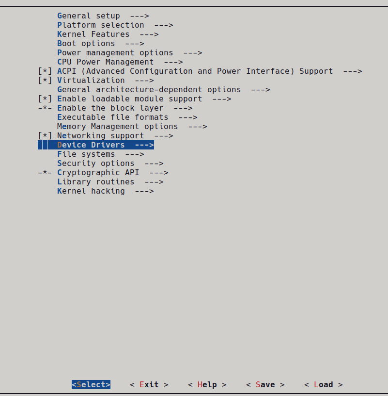
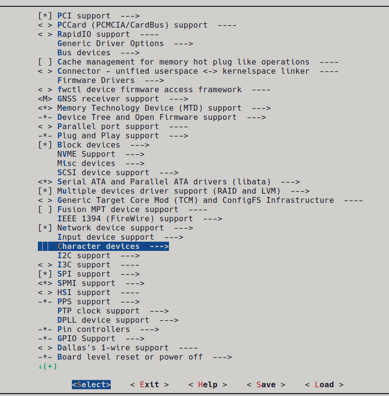
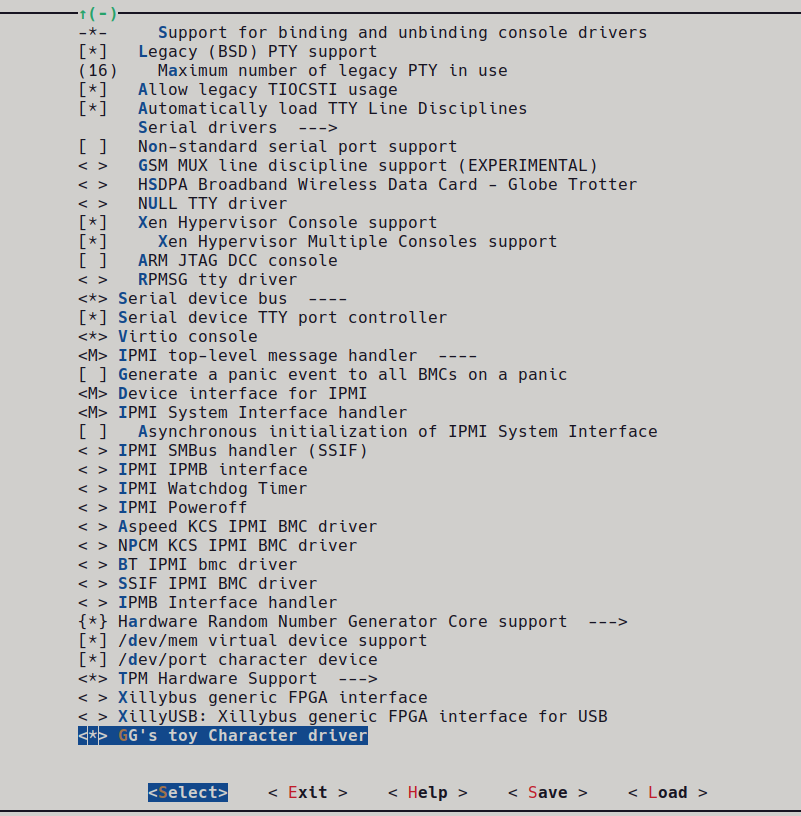
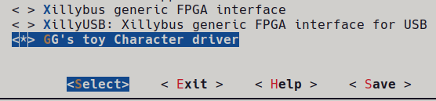
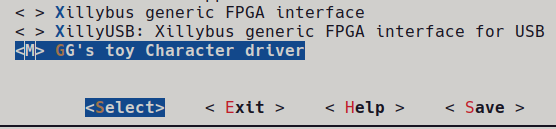
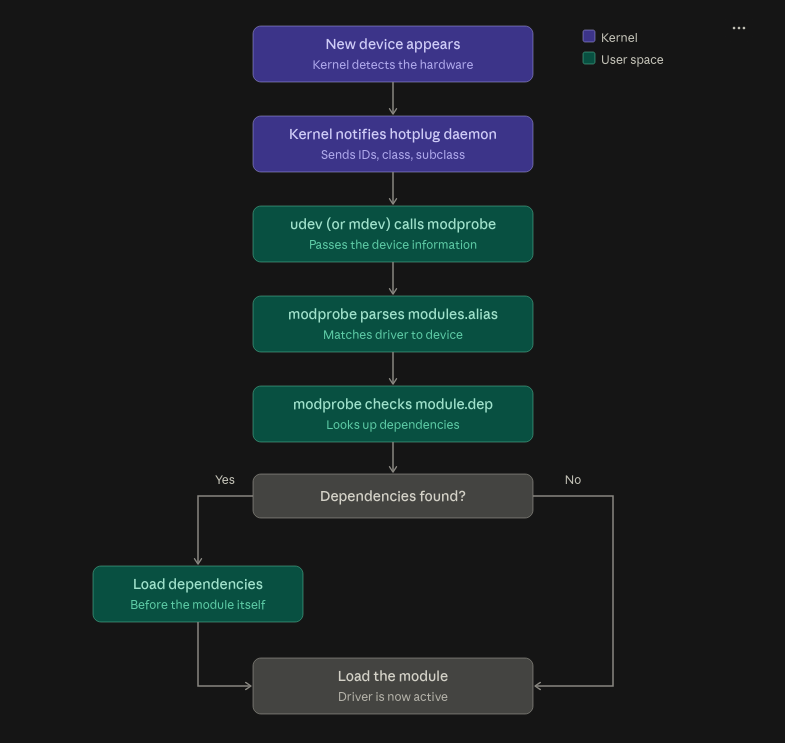

# Chapter 2 notes
* Loadable modules are plugins. Usually device drivers, filesystems and frameworks are compiled as loadable modules.
* Loadable modules extend the kernel feature without needing to restart the machine
* To support module loading, the kernel must be built with following feature enabled:

```txt
CONFIG_MODULES=y
```
* To check if the current running system has modules enabled:
```sh
cat /boot/config-`uname -r` | grep CONFIG_MODULE
```
* For a module that is loadable, it makes sense to configure it to be unloadable as well. To be able to unload a module the following:
```txt
CONFIG_MODULE_UNLOAD=y
```

## Loadable Modules
* __init and __exit are kernel macros, defined in include/linux/init.h, as shown here:
```c
#define __init __section(.init.text)
#define __exit __section(.exit.text)
```

- The `__init` and `__exit` macros are direct instructions (or "hints") to the compiler and linker to isolate initialization and cleanup code into specialized, dedicated Executable and Linkable Format (ELF) memory sections.

- Instead of treating them like ordinary functions, this separation opens up a window for the Linux kernel to perform runtime memory optimizations:

* Minimum requirement for a loadable module is the initialization method called when the module is loaded (by probably `modprobe` or `insmod` )
```c
static __init module_entry_point_function(void);
```

* If a module is built as loadable module, then the exit point method should be also provided and is executed when the module is unloaded (by probably `modprobe -r` or `rmmod`)
```c
static void __exit module_exit_point_function(void);
```

* `__init` and `__exit` method are invoked only once, whatever the number of deivce currently being handled by the module (provided the module is a device driver)

* It is common for modules that are platform or device driver to register a platform driver and the associted `probe`/`remove` callback in their init function
   - The `probe` is then executed each time a device handled by the module is added to system
   - The `remove` is executed each time a device handled by the module is removed from system

* Different behavior of `__exit` sections for statically compiled and loadable module
   - For statically compiled module (`CONFIG_MODULE_UNLOAD=n`)
        - Because a built-in module can never be unloaded, its exit function will never be  called.    
        - In this specific scenario, the __exit macro takes effect by telling the compiler to entirely omit and discard that function's code to save RAM.
    - For (un)loadable moudle (`CONFIG_MODULE_UNLOAD=y`) , with `*.ko` extension
        - `__exit` has no effect—meaning it does not strip or omit any code. 
        - The exit function is kept fully intact in memory so the kernel can safely execute it when you unload the module.

### Memory layout and timeline of the __init and __exit sections
```txt
1. COMPILED BINARY FILE (.ko file on disk)
+-------------------+--------------------+------------------------+

| .text section     | .init.text section | .exit.text section     |
| (Regular Code)    | (Functions w/      | (Functions w/          |
|                   |  __init macro)     |  __exit macro)         |
+-------------------+--------------------+------------------------+


2. LIVE IN KERNEL MEMORY (Right after loading via insmod)
+-----------------------------------------------------------------+

| RAM ALLOCATION                                                  |
|  +----------------+  +-------------------+  +-----------------+ |
|  | .text section  |  | .init.text        |  | .exit.text      | |
|  | (Regular Code) |  | (init function)   |  | (exit function) | |
|  +----------------+  +-------------------+  +-----------------+ |
+-----------------------------------------------------------------+
                         |
                         |  Kernel calls the init function...
                         v  
                  Initialization Complete!


3. RUNNING MODULE STATE (Optimized Layout)


   IF BUILT-IN (=y) OR NO UNLOAD:      IF DYNAMIC LOADABLE (=m):
   +----------------+                  +----------------+  +-----------------+

   | .text section  |                  | .text section  |  | .exit.text      |
   | (Regular Code) |                  | (Regular Code) |  | (exit function) |
   +----------------+                  +----------------+  +-----------------+
   [ .init.text FREED ]                [ .init.text FREED ]
   [ .exit.text FREED ]                                   
```
* To inspect the Module information section of kernel object, use
```sh
objdump -d -j .modinfo your-kernel-file.ko
```
## Bulding a Linux Kernel Module
* Two solutions exists for building a kernel module:
    1. **Out of Tree Building**
        - Applicable when the module source code is outside of kernel soruce tree
        - In this style, the module build cannot be integrated to kernel configruation
        - Is applicable exclusively to loadable modules
    2. **Building within kernel tree**
        - Module compilation can be integrated within kernel configuration
        - Allows upstream sync within kernel source tree
        - Allows to build either statically linked or loadable kernel module
* Linux kernel maintains its own build system called `kbuild`(k is lower case)
* `kbuild`allows configruation of linux kernel and compilation based on the specific configuration
* `kbuild` relies on three files to achieve the configuration and compilation
    - `Kconfig` : for feature selction (K is upper case)
    - `Kbuild`  : for compilation
    - `Makefile`: also for compilation
### `Kbuild` or `Makefiles`
* From within the build system the makefile can be called either `Kbuild` or `Makefile`
    - If both exists, `Kbuild` will be used
* In short, makefile is a special file used to execute a set of actions, most common amongst which is program compilation
* There is a dedicated tool to parse makefile called `make`
* Using the `make` tool the kernel build command pattern resembles the following:
```sh
make -C $KERNEL_SRC M=$(shell pwd) [target]
```
where
    - `$KERNEL_SRC` refers to path of prebuilt kernel
    - `-C $KERNEL_SRC` instructs make to change to the specified directory when executing and change back when finished
    - `M=(shell pwd)` instructs kernel build system to move back to this directory to find the kernel module that is being built. Value given to `M` is the absolute path of directory where the module sources or associated `Kbuild` files are located
    - `[target]` corresponds to the subset of `make` targets available when building an external module, which can be one of the following:
        1. `modules` : default target for external module. Has same functionality as if no target was specified
        2. `modules_install`: installs external modul(s). Default location is `/lib/modules/<kernel-release>/extra`, but can be overridden
        3. `clean`: removes all generated fils in module directory only

* How to instruct build system to build or link the object file:
    - Specify the name of the modules to be  build along with the soruce files. 
    - Simple  example of object being builf from single source file
    ```
    obj-<X> := <module_name>.o
    ```

    - If more than one source (.c) file is used, for e.g. `foo.c` and `bar.c` to build module then use

    ```mk
    obj-<X> := foo.o bar.o
    ```
    - NOTE: <X> can have values 
        - `m` for loadable modules
        - `y` for static kernel modules, but outside of kernel source tree `<module-name>.o` will not be built
        - empty , in which case the `<module-name>.o` will not be build

### Out of tree building
* before a loadable external module can be built out of tree, ensure that complete and precompiled kernel source tree is avaiable
* steps to ensure the precompiled kernel source tree is available
    - run `uname -r` on your system to get the kernel version
    - check if the kernel source tree is present in the path `ls /lib/modules/$(uname -r)/build`. This should list several files and folders on the system
    - If the kernel source tree is not present, then it can be installed via 
        ```sh
        sudo apt update && sudo apt install build-essential linux-headers-$(uname -r)
        ```
* Browse to the path where the make file is present and compile the source by typing `make`
* For cross compiling for 32 or 64 bit the following command lines are needed
```
#32 bit cross compilation
make ARCH=arm CROSS_COMPILE=arm-linux-gnueabihf-

#64 bit cross compilation
make ARCH=aarch64 CROSS_COMPILE=aarch64-linux-gnu-
```
    - enusre the kernel source path is specified in the makefile correctly

### In tree building
* In-tree building allows module features to be exposed in cofiguration menu via `make menuconfig`
* First identify where the module will be hosted in the tree
    - for e.g consider subdir `driver/char` 
    - Considering the source file name to be `mychar/myChardev.c` containing the said module source code
* In the path where the module is hosted, place a `Kconfig` file
    - In this case the `Kconfig` is placed in `driver/char/mychar/` path in linux tree  
* Add the correct content in the content in the `Kconfig`
    - In this case the `Kconfig` should can the following

    ```txt
    config GG_MYCDEV
      tristate "GG's toy Character driver"
      default m
      help
          Say Y here to support /dev/mychar char device
    ```
    - In this `Kconfig`file the default state of the module is `m`
* Add a `Makefile`  in the same path where the module source code and the `mychar/Kconfig` is placed for the module with approrpiate build instructions
    - In this case the `Makefile` should go to `driver/char/mychar/` path as well
    - The `mychar/Makefile` in this case can be for eg a simple oneliner
    
    ```  
    obj-$(CONFIG_GG_MYCDEV) += mychardev.o
    ```

    Note: the string after `CONF_` is same as the config defined in `Kconfig` file which in this case is `GG_MYCDEV`
        - The entire config name in `Makfile` is then `CONFIG_${NAME_OF_CONFIG_IN_KCONFIG_FILE}`
        - In this case the config name is `CONFIG_GG_MYCDEV`
    - The name of the `.o` should match the source file name
    - In this case the object file in `Makefile` should be declared `myChardev.o`

* In the parent directory of the `drivers/char` the `Kconfig` and the `Makefile`also needs to be updated to link to the `drivers/char/mychar/Kconfig` and `drivers/char/mychar/Makefiles`
    - In this case the  following line should be added to `drivers/char/Kconfig`
    ```
    source "drivers/char/mychar/Kconfig"
    ```
    - And the following line should be added to `drivers/char/Makefile`:
    ```
    obj-y +=mychar
    ```
    Note the `-y` appended to `obj` above tells the parent `Makefile` to instruct to check the child folders `Makefile` configuration (in this case the value defined by variable `$(CONFIG_GG_MYCDEV)`) and apply that config

* In the specific architecture of interest, in the `config` file, the same device config above as in the module `Makefile` should be updated. 
    - In this case for arm64 architecture the `arch/arm64/configs`, the following should be added
    ```
    CONFIG_GG_MYCDEV=m
    ``` 
    to configure the module as loadable module
    - If the module is desired to be built as statically compiled module by default then the following should be added
    ```
    CONFIG_GG_MYCDEV=y
    ```
* If everything has been configured correctly the device should appear on the menuconfig once the correct menuconfig is launched
    - In this case
    ```
    make ARCH=arm64 CROSS_COMPILE=aarch64-linux-gnu- menuconfig
    ```
    - The following image shows how to navigate to the char driver in the menuconfig : 
        - Home Page of menuconfig highlighting device driver config option  
          

        - Device driver page of menuconfig highlighting char driver config option  
          

        - Char driver page of menuconfig, at bottom, highlightig the toy char driver that can be configured  
          

    - In the image the default configuration in the menu is `<*>` indicating statically compiled module  
          

    - If on the keyboard, `m` is tapped, the driver is configured to be loadable module indicated by `<M>` in the menuconfig  
        
    - If on the keyboard `n` is tapped, the driver is not compiled at all, indicated by empty angled brackets `< >`  
        

### Handling module parameters
* Similar to user program, a kernel module can accept argument from command line
    - used for developer/debug configurations of module so that module doesn't need compilation over and over again
    - each command line param should be declared using `module_param()`macro
    - `module_param()` macro defined in `linux/moduleparam.h` as
    ```
    mdule_param(name, type, perm)
    ```
    - Description of the elements is as follows
        - `name` : no brainer, this should be the name of parameter variable
        - `type` : also no brainer, this should be the type of the parameter. Permitted types are `bool, charp, byte, short, ushort, int, uint, long, ulong`. Note `charp` is character pointer
        - `perm` : represents file permissions. For eg `SI_IRUSR, SI_IWUSR, S_IXUSR, S_IRGRP, S_IWGRP, S_IRUGO`, where the following applies
            - `S_I` is just a prefix
            - `R`=read, `W`=write, `X`=execute
            - `USR`=user, `GRP`=group, `UGO`=user groups and others
    - to set multiple permissions the flags can be combined with `|`
    - if `perm` is `0`, the file parameter in Sysfs will not be created
    - using `S_IRUGO` is recommended (? why though , to be figured out later)
* inspect the description of the parameters using `modinfo`
```sh
modinfo ./module_name.ko
```
#### Modifying module params of already loaded modules
* TODO

## Dealing with symbols exports and module dependencies
* Linux kernel allows exporting of symbols (variables and functions) such that they are visible to other dynamic modules that depend on those symbols
    - This approach should be used with caution though. A normal functioning driver should be self complete and should not depend on symbols from other kernel modules
* For this purpose, there are two macros provided by kernel
    - `EXPORT_SYMBOL(symbolname)` : This macro exports a function or a variable name to all modules
    - `EXPORT_SYMBOL_GPL(symbolname)`: This macro exports a function or a variable to only GPL modules
* The module that wants to use the exported symbol (say **Module B** wants to use symbol from **Module A**)
    - should declare the symbol with `extern` keyword
    - include the header to corresponding compilation unit
* Code that is built into the (statically compiled) kernel itself can access any non-static symbol via extern keyword as with conventional C code
* TODO: parctical code example missing

### Concept of module dependencies
* A dependency of module **B** on moudle **A** implies that module **B** uses one or more symbols exported by module **A**
* Linux kernel provides several tools to handle the dependencies

#### The `depmod` utility
* A tool run during kernel build process to generate module dependeny files
    - `depmod` reads each module in `/lib/modules/$(uname -r)/` to determine what symbols the modules should export and what symbol the module needs
* The reusult of this *parsing* step is written to a `modules.dep` file and its binary version `modules.bin`
* in short the result of `depmod` is an indexing of imported and exported dependencies 
* you can inspect the your current system to check the contents of `modules.dep` file

```sh
ls /lib/modules/`uname -r` # verify the modules.dep exists
cat /lib/modules/`uname -r`/modules.dep # print the contents of modules.dp on console
```
### Module loading and unloading techniques

#### Manual Module loading 

* As seen from previous exmples, for a module to be operational, it has to be loaded into the kernel.
* There are two commands:
    - `insmod` : preferred during development 
    - `modprobe` : does more than just loading the command, should be used during production
* so far we have used `insmod` and it can accept podule path as arguments and the module parameters
* `modprobe` is mostly used by system admins or production systems.
    - this command parses `modules.dep` file in order to load dependencies first, prior to loading a given module
    - `modprobe` automatically handles module dependencies (just like apt package manager in linux)
    - it must be invoked as follows
    ```sh
    modprobe mydrv ## need practical example
    ```
* Whether we can use `modprobe` depends on `depmod` being aware of module installation (what does this mean ???)

#### Auto module loading (useful  hotplugging of a device)

* When kernel developers write drivers, they know exactly what devices and hardwares the driver will support
    - kernel developers are then responsible for feeding the drivers with product and vendor ID of all devices supported by the driver
    - *product ID, vendor ID, deivce class, device subclass, interface* are few among many of the device decription used to identify the deivce during auto loading  
* The `depmod` tool processes the module files in order to extract and gather the informations of product and vendor id, and generates `modules.alais` and its binary counterpart `modules.alias.bin` located in the same path as `modules.dep` , i.e `/lib/modules/$(uname -r)`
    - who should call the `depmod` tool ?

* For autoloading of the kernel module, a hotplug agent (aka a device manager) is needed that will register with kernel to get notified when a new device appears
    - usually `udev` or `mdev` is the hotplug (device manager) agent (running in user space)
* The notification is done by kernel, sending the device's description to the hotplug daemon
    - the hotplug daemon calls the `modprobe`
    - `modprobe` parses the `modprobe.alias` (which was generated by `depmod`) in order to match the driver (kernel module in this case) associated with the device
    - `modprobe` will then look for dependencies in `module.dep` for resolving the external symbols. If any dependencies are found, then then those symbols will be loaded
    - finally the module is loaded
* See the flowchart below  


* To see it in action with the module you built earlier, run 
```sh
modprobe -S $(uname -r) --show-depends <module_name>
```
for an installed module. It prints the dependency chain modprobe would load, in order.

* **NOTE**: `modprobe` , `insmod`, `rmmod` are user space programs which calls into kernel
* In summary `modprobe`does the follownig in user space
    - Reads `modules.alias` and `modules.dep` (generated by depmod)
    - Applies policy from `/etc/modprobe.d/` (blacklists, module options)
    - Works out the dependency order
    - Opens each `.ko` file and passes it to the kernel through the `finit_module()` syscall (older systems use `init_module()`)
* What the kernel does on that syscall:
    - Checks the module (signature, version compatibility)
    - Allocates memory and links the module into the running kernel
    - Resolves its symbols against exported kernel symbols
    - Runs the module's `module_init function`
* The same split applies to the other tools:

    | Tool          | Role                                                        |
    |---            |---                                                          |
    | `insmod`      | Loads one `.ko` file you name. No dependency handling.      |
    | `modprobe`    | Loads by module name or alias, and loads dependencies first |
    | `rmmod`       | Unloads one module through the `delete_module()` syscall    |
    | `modprobe -r` | Unloads a module and its now-unused dependencies            |

    - All of them are thin user-space front ends over the same kernel syscalls. You can confirm this with strace:
    ```sh
    sudo strace -e trace=finit_module,init_module modprobe <module_name>
    ```

#### Auto module loading during bootup

* To achieve a module loading during boot time, create a file `/etc/modules-load.d/<filename>.conf`
* These configuration fiels are processed by `systemd-modules-load.service` 
    - provided `systemd` is the initialization manager
    - on `sysVinit`systems these are processed by `etc/init.d/kmod`script

#### Module unloading
* If a module has been loaded by `insmod`, it is preferred to be unlaoded by `rmmod`

```sh
rmmod -f mymodule
```

* If the module has been loaded by `modprobe` then to do a proper cleanup of unused dependenices, run

```sh
modprobe -r mymodule
```
* Finally to be able to check if a module was loded use `lsmod`. For e.g
```sh
lsmod | grep module_name # without .ko
##output
Module                  Size   Used by
module_param_example    12288  1 some_other_module
```
 - output of `lsmod` without `grep` shows 
    - the modules loaded currently by the kernel
    - the memory it uses
    - number of users that use the module and the name of the dependent module  

## Error handling and printing in modules

### Error handling

* To prevent a user space application from receving wrong error code and taking incorrect action, linux kernel tree defines error codes in/for kernel tree that covers almost every possible case that can occur

* Errors can be found in two possible files
    - `include/uapi/asm-generic/errno-base.h`
    - `include/uapi/asm-generic/errno.h`
* Most of the time standard way to return error is in the form `return -ERROR_ID`, i.e negative sign applied to error code
    - this form is always used for handling errors for system calls.
    - for eg for an I/O error error code is `EIO` and the module should return `-EIO`
    ```c
    dev = init(&ptr)
    if(!dev)
        return -EIO
    ```
* Errors sometimes cross the kernel space and propagate themselves to user space. 
* If returned error is an answer to system call (`open, read, ioctl, mmap,...`), the error will automatically be assigned to user space `errono` global variable
    - on the `errorno` global variable `strerror(errorno)` can be used to convert the error to a readable string 

* When an error is encountered, the kernel must clean up resources
    - usual way to do is to use `goto`
    - reason for using `goto` is to keep the flow less error prone by avoiding too many nested checks and conditional branching
    - `goto` can help to keep the control linear.
    - use `goto` in kernel to move forward ina function only
        - don't implement loops or move backwards using `goto`
    
* try to create an example from this in the repository

### Handling null pointer errors
#### macro "void *ERR_PTR(long error_val)"
* A function like `device_create()` is designed to return a pointer
    -  On failure it can't also return a value like `-ENOMEM`. 
    - Returning NULL would work, but the caller couldn't tell why it failed. 
    - The kernel instead encodes the negative errno inside the pointer value itself.
    - This works because the top 4095 values of the address space (`-MAX_ERRNO=-4095` to `-1`, `MAX_ERRNO` being 4095) are never valid kernel pointers. 
    - A pointer in that range is an error code, not an address.
*  Mostly used by a callee , i.e., a function called by another function
* In short the macro `void *ERR_PTR(long error)` returns error converted as a pointer
* Example :

```c
//a function called by another function in kernl to
// allocate memory for a device
static struct my_dev *my_dev_create(void)
{
    struct my_dev *d = kzalloc(sizeof(*d), GFP_KERNEL);
    if (!d)
        return ERR_PTR(-ENOMEM);

    if (hw_init_failed(d)) {
        kfree(d);
        return ERR_PTR(-EIO);
    }
    return d;
}
```

#### Macro "long IS_ERR(const void *ptr)" and "long PTR_ERR(const void *ptr)"
* Both are intended to be used on caller side. 
* `long IS_ERR(const void *ptr)` :  This macro checks if returned value is pointer error
* `long PTR_ERR(const void* ptr)`:  Returns error code from the pointer
    - can be considered as inverse of `ERR_PTR`

    ```c
    struct class *cls;
        struct device *dev;

        cls = class_create("mychar");
        if (IS_ERR(cls)) {
            pr_err("class_create failed: %ld\n", PTR_ERR(cls));
            return PTR_ERR(cls);        /* propagate -ENOMEM etc. */
        }

        dev = device_create(cls, NULL, devt, NULL, "mychar0");
        if (IS_ERR(dev)) {
            class_destroy(cls);
            return PTR_ERR(dev);
        }
    ```
#### Pitfalls in error handling
* Never test for result of `ERR_PTR` in `if` statements to check for vaild references
    - For e.g. if an error pointer `-ENOMEM` which is not NULL is used as `if(!ptr)`, it can hint that the pointer is valid and proceed to apply the intended settings which might later crash the application
* Don't call `PTR_ERR` on valid pointers or on `NULL`. 
    - `PTR_ERR(NULL)` returns 0 which might look like success
    - `PTR_ERR` should always be used after `IS_ERR` asserts true
* Following table summarizes the usage convention

| Helper         | Direction         | Use it when                                                                      |
|---             |---                |---                                                                               |
| `ERR_PTR(err)` | errno to pointer  | you are the callee and want to return an error from a pointer-returning function |
| `IS_ERR(ptr)`  | tests the pointer | you are the caller and need to know whether the returned pointer is an error     |
| `PTR_ERR(ptr)` | pointer to errno  | you are the caller, `IS_ERR()` was true, and you want the actual error code      |

## Printing messages

### The printk and several log levels for printk in kernel
* `printk` is to linux kernel what `printf` is to user space application in C. 
* linux kernel doesn't use C headers or C libraires for purpose of maintaining its size and efficiency
    - using C libraries  and headers will bloat the kernel
    - therfore apart from many other API's that linux kernel provides, `printk` is one of them
* Depending on how important the message was to print `printk` allows to choose between 8 log levels
    - the log levels are devined in `include/linux/kern_levels.h` header
    - the following table shows the log levels 

    | Level | Macro          | `pr_*` helper  | Meaning                                                    |
    |---    |---             |---             |---                                                         |
    | 0     | `KERN_EMERG`   | `pr_emerg()`   | System is unusable                                         |
    | 1     | `KERN_ALERT`   | `pr_alert()`   | Action must be taken immediately                           |
    | 2     | `KERN_CRIT`    | `pr_crit()`    | Critical conditions                                        |
    | 3     | `KERN_ERR`     | `pr_err()`     | Error conditions                                           |
    | 4     | `KERN_WARNING` | `pr_warn()`    | Warning conditions                                         |
    | 5     | `KERN_NOTICE`  | `pr_notice()`  | Normal but significant condition                           |
    | 6     | `KERN_INFO`    | `pr_info()`    | Informational                                              |
    | 7     | `KERN_DEBUG`   | `pr_debug()`   | Debug-level (compiled out unless `DEBUG` / dynamic debug)  |

    - Lower number = more severe.
    - A message reaches the console only if its level number is **lower than** `console_loglevel`.
    - All messages are still stored in the kernel ring buffer (`dmesg`) regardless of console level.
    - The `pr_*` helpers are in `include/linux/printk.h`, which `<linux/kernel.h>` pulls in, so a normal module gets them without extra includes.

### Changing log levels from the command line

* Read the current settings

    ```sh
    cat /proc/sys/kernel/printk
    ```
    - This prints four numbers
    - On a typical ubuntu system it prints `4 4 1 7` 
    - Meaning of the 4 numbers above

    | Position  | Name                      | Value in `4 4 1 7` |
    |---        |---                        |---                 |
    | 1st       | `console_loglevel`          |   4                |
    | 2nd       | `default_message_loglevel`  |   4                |
    | 3rd       | `minimum_console_logelvel`  |   1                |
    | 4th       | `default_console_log_level` |   7                |

    - meaning of the 4 settings in practice 
        - `console_loglevel=x` : only messages with a level number below x reach the console, so levels [0,x-1] 
            - for eg `x=4`(*emerg, alert, crit, err*) reach the console. pr_warn() (level 4) and anything less severe stay out of the console, though they are still in dmesg.
        - `default_message_loglevel= 4`: a `printk()` with no level prefix is treated as `KERN_WARNING`.
        - `minimum_console_logelvel=1` : you can't set the console level below 1 (for example with `dmesg -n`), so *emerg* messages can't be silenced on the console.
        - `default_console_loglevel = 7`: the kernel's built-in default for the first value. Ubuntu then lowers console_loglevel to 4 through a sysctl setting, which is why the first and fourth numbers differ.


* to change the log levels at run time execute the following as root
```sh
sudo dmesg -n 7                             # set console_loglevel only (7 = show everything)
echo 7 | sudo tee /proc/sys/kernel/printk   # writing only the first value
sudo sysctl -w kernel.printk="7 4 1 7"      # set all four values
```
* See the source code and associated instructions for thorough practical understanding
    - [5-source-code](src/5-printk/printk_levels_demo.mod.c)
    - [5-printk-instructions](src/5-printk/TESTING_INSTRUCTIONS.md) 

### Modern interfaces for logging in linux kernel
* `printk` remains low level printing API in kernel
* `printk`/log-level pairs have been ecoded into clearly named helpers which are recommended to use in new drivers
* the linux kernel has follwoing new APIs for drivers
    - `pr_<level>` : used in regular modules that are not drivers
    - `dev_<level>(struct device * dev, ...)` : this is to be used in device drivers that are not network device (aka `netdev` drivers) 
    - `netdev_<level>(struct net_device * dev, ...)` : this is to be used in `netdev` drivers exclusively
* in all the above api, `level` represents log level encoded into meaningful name . 
* Table below outlines all the three logging api in 7 differnt log levels : 

| Module helpers | Driver helpers | Netdev helper | Description | Log level                                                                             |
|---             |---             |---            |---          |---                                                                                    |
| `pr_debug`, `pr_devel` | `dev_dbg` | `netdev_dbg` | Used for debug messages. `pr_devel()` is dead code. This means it is not compiled at all, so it's not present in the final binary unless `DEBUG` is defined. The preferred way to go is `pr_debug`. | 7 |
| `pr_info` | `dev_info` | `netdev_info` | You can use this for informational purposes, such as start up information at a driver initialization. | 6 |
| `pr_notice` | `dev_notice` | `netdev_notice` | This is a notice – nothing serious but notable, nevertheless. It is often used to report security events. | 5 |
| `pr_warning` | `dev_warn` | `netdev_warn` | A warning that means nothing serious by itself but might indicate problems. | 4 |
| `pr_err` | `dev_err` | `netdev_err` | An error condition, often used by drivers to indicate difficulties with hardware. | 3 |
| `pr_crit` | `dev_crit` | `netdev_crit` | A critical condition occurred, such as a serious hardware/software failure. | 2 |
| `pr_alert` | `dev_alert` | `netdev_alert` | Something bad happened and action must be taken immediately. | 1 |
| `pr_emerg` | `dev_emerg` | `netdev_emerg` | Emergency messages – the system is about to crash or is unstable. | 0 |
